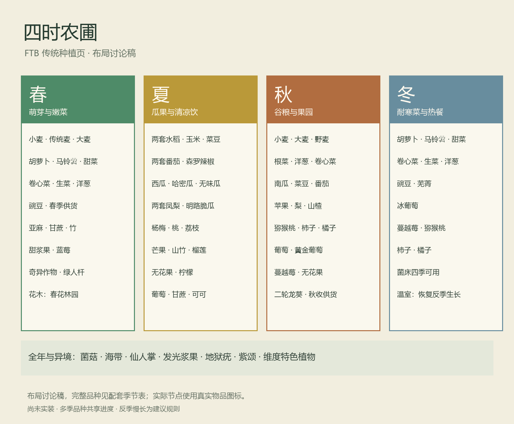
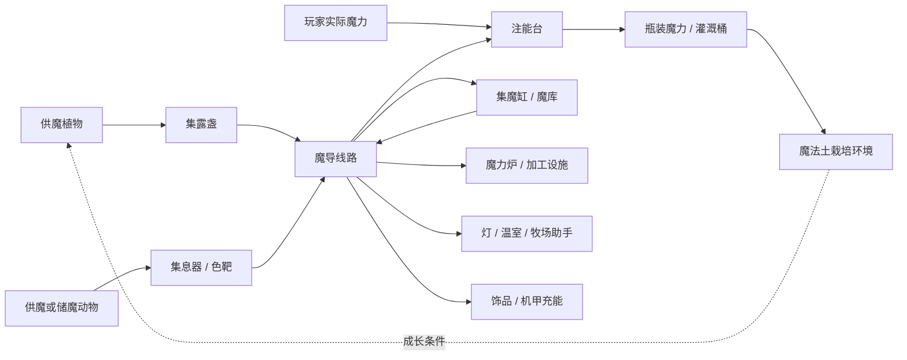

# FTB 四条生活路线与魔力体系方案

2026-10-06 · 第一版讨论稿 · 尚未实装。

本轮只盘点、设计和绘制任务页示意。不会改游戏代码、配方、任务文件、存档或天空岛。本文的规则和数值均为建议，等待主策确认。过去文档中“普通土随便种、采样夹发现种源、魔力转 FE”的规则，不作为本轮新设计的目标。

配套：[传统植物盘点与四季安排](传统植物盘点与四季安排-20261006.md)、[魔植与异兽逐品种任务规格](魔植与异兽逐品种任务规格-20261006.md)。盘点证据在 `design/ftb-routes-20261006/`。同伙也可直接在这些文档上提改动。

## 一、希望玩家实际玩到什么

一位玩家可以经营四季菜园，为酒馆供货；另一位收集异兽，培育助手；还有人把花园和牧场搭成漂亮的供魔庭院，驱动工坊和远征装备。三者都能从小规模开始，互相交易，也能独立玩。主线不要求集齐所有作物、所有动物或建成大型魔力网络。

完整生活循环是：委托指路与野外发现 → 带回可再生种源或捕获个体 → 栽培/牧养 → 食物、材料和魔力 → 自用、加工或卖给商店/其他玩家 → 家具、房产、土地与下一次远征。银行维持已设计的现实时间逻辑；作物与工坊不因此获得离线无限产量。

### 三种架构的取舍

|方案|玩起来如何|取舍|
|---|---|---|
|建议：统一魔力，生物各有产能行为，收集器＋魔导线路运输|看得见花草和动物在工作，日常接线容易，复杂布局自愿探索|容易解释，也能留下设计空间|
|完全自由飞行的魔力弹网络|观赏性强，布置发射器和接收器像解谜|入门瞄准负担大，网络交叉不易排查|
|每种元素各用一种能源和线路|元素特色很强|多种瓶、线、仓库和转换器会挤压生活玩法，不建议作为基础规则|

建议采用第一种，稀有动物的能量炮另走有趣的“定向接收”支路。元素决定视觉和用途特色，基础网络内只有一种魔力，不让玩家为灯具区分六种电。

## 二、先核对旧实现

已读取实际 PCL 版本的 281 个 JAR，扫描作物/种子标签、语言、方块状态和部分植物类继承关系。发现 4,810 条名称匹配候选资源及 193 份相关标签；候选数包含家具、食物展示块、盆栽、同株状态和装饰，不是“有 4,810 种能种的作物”。

- 传统生产植物来自原版、农夫乐事、果园乐事、凤梨乐事、森罗厨房、森罗酒馆、Supplementaries、Conquest，以及其他群系/维度模组。详见独立盘点表，两个模组同名番茄/凤梨仍保留各自身份。
- Conquest 不全是装饰：其 `AbstractCropsBlock` 确实继承 `CropBlock`，作物标签列出 15 个方块 ID。不能把这些全部当摆件排除；其具体掉落和种植兼容需要后续进游戏逐项验收。
- 当前没有检出 `sereneseasons` 或 `eclipticseasons` 季节模组。部分农业模组内的季节兼容标签，不代表包中已经运行四季。
- 本包现有 29 种原创植物、24 种原创牧养动物；现有普通/精炼魔力瓶容量分别为 24/72，现有运输设施使用 FE。这些是旧实现。下面的瓶容量、纯魔力网络、三档捕获与新土壤都是拟修改规则。

静态盘点能确认资源和标签存在，不能代替游戏中的注册、掉落与自然生成测试。新增/遗漏品种有明确归类原则，实施前还需导出实际注册表并补齐映射；不靠名称正则直接套季节。

## 三、四页任务书怎么摆

|独立章节|题名|顶部教学|主体|末端奖励|
|---|---|---|---|---|
|传统种植|四时农圃 · 把日子种进土地|当季、播种、普通土与水、第一份收成|春夏秋冬四栏；常绿/异境小附栏|《四时厨房与农事手册》|
|魔法种植|魔植花园 · 异乡的第二次萌芽|野外采果/收种 → 魔法土源 → 流动魔力 → 首次成熟|每株独立向下连接互动、产物、加工；供魔新种在后部|《魔植花园图鉴》，保留品种发现记录|
|原创动物|异兽牧场 · 让相遇有个归处|笼子分级、长按捕获、安置窝点、食槽、繁育|普通品种各有一列；浮鲸等特殊品种独立下区|《异兽牧养册》及设施操作页|
|魔力系统|魔力工坊 · 让花园点亮家|注能台、容器、四材料炉、第一根线路|起步 → 生物供魔 → 储运 → 工程/远征/战斗分支|《魔导工坊手册》，不强制走战斗分支|

原任务页保留其他作者/玩家编辑的内容。本轮只提替换旧生态教学入口并新增四个独立章节，实施时按 ID 定位目标章节，不批量覆盖任务书。每章有“返回生活路线”链接；跨章关联用链接节点，避免满页斜线。

### 视觉约定

传统页用米色底、墨绿细框和四幅横向季节小景：春芽、夏果、秋穗、冬雪。色彩是春青绿、夏金黄、秋赭橙、冬霜蓝。下面放真实作物物品图标，名称保持可读，装饰景图不遮挡按钮。魔植页用深绿与少量青紫光；牧场用暖木色；工坊用深铜和青绿。

魔植/动物每列统一四层：品种大图标 → 独特互动 → 产物 → 两到三个代表用途。相邻列独立竖线，不共享一条横向依赖线。每行最多六列，品种多就向下分带，不缩成密集图标墙。特殊品种下方留更大的图标、栖居图和流程图。

附图仅为任务布局讨论图，不是已经写入 FTB 的背景资源；实施时还要在实际 GUI 比例下检查文字、缩放、按钮和连线。

### 教学任务应当检查什么

拿到种子/果实是发现节点；实际种下一株是栽培节点；成熟采收和真实产物是收获节点；做成食物或器件是用途节点。动物节点检查捕获、绑定窝点、真实活取/助手行为。能量节点检查首次收集、储存和让设备实际运行。

物品检测默认不消耗；只有明确写“交货”的委托才消耗物品。种植、捕获和供魔等行为需要后续接入行为任务，不能仅凭持有物品冒充完成。图鉴条目可以始终看见，完成某一条不锁住另一条。主线不依赖“全部完成”。

教学奖励主要是手册和小量工具耗材；第一次流程可给一桶起步用流动魔力。不给每个品种重复高额铜币，避免刷图鉴奖励取代真实经营。书籍可在商店廉价补购，丢书不锁玩法。

## 四、传统种植与四季

### 建议的基础规则

所有玩家有种源就能种，保留原模组的常规土壤、支架和水等条件；不新增农业等级、许可证或银行购地作为野外种植门槛。天空岛公共区受保护，购买地块后能施工；其他合法野外土地正常使用。

四季建议影响生长速度，不在换季时杀死作物：应季 100%，相邻季 60%，明显反季 25%；全年型不受影响。季节表上多季标签属于同样正常生长，不要求玩家猜“主季/副季”。已熟产物可正常收取。缺水等原有机制单独提示。

建议每季 7 个游戏日，一年 28 日；季节按世界历法日变化，睡觉推进日期，`/time` 测试也会改变季节；植物本身累计成长仍按运行时间，不因改时间瞬间成熟。过渡日会提前提示。联机全服同一历法，银行现实时间计息不改。

主世界居住区使用统一农历，不叠加难懂的湿度/温度百分比。其他维度保留原生气候作为默认环境，带回主世界栽培时用农历。模组原生限定土壤/维度的植物先标清限制，是否放开需按品种处理，不能在方案里假定都能搬回种。

冬季仍有耐寒菜、菌菇、储藏食品和酒馆需求，避免新玩家等春天。温室是后续的魔力用途：保温框架围成封闭空间，一台护候灯服务不超过 9×9 的农圃，维持反季 100% 生长；不增加产量倍数。温室耗魔，断能回到原季节速度，作物不死。温室只针对传统作物，魔植不受季节限制。

### 两本书怎样给

第一份普通收成奖励《四时厨房与农事手册》：农历、每个品种的种法、常见料理、保存/供货去向。传统页不用把所有烹饪配方拉成长串。

首次做成一道料理解锁手册的“厨房索引”：按主食、热餐、便携、饮品、甜点分类，条目列出真实设备和已核对配方，并链接 JEI。配方发生魔改时同步更新，不抄一份会过期的第三方攻略。每道菜至少标一项用途：远征、自食、居民礼物或商店订单。

## 五、魔法土和流动魔力

### 魔法土源：沿用你的核心规则

配方是八个普通泥土围一瓶魔力，获得一个魔法土源；瓶内消耗 100 魔力，空瓶返还。新体系拟将普通瓶容量改为 100，精炼瓶改为 400；这是容量重设，不是当前游戏值。

以土源所在方块为中心，同一 Y 高度，X/Z 各 ±4，共 9×9 的区域。中心已占一个土源，所以最多转换另外 80 个泥土。放下后 10 秒转换；后来补放的泥土在下一轮 10 秒检查中转换。每个泥土变一块魔法土，不生成额外泥土。

第一版只转换 `minecraft:dirt`，不动草坪、耕地、泥巴、道路或建筑。转换只能发生在玩家有建设权限的位置；不碰小镇公共地形、邻居地块和方块实体。源所在格也能种魔植，不需锄地。拆掉土源后已转化土保留，但不再扩展。普通魔法土不继续传染。

土源上表面看起来是可种的土，边缘有细纹；不能为了发光把整块做成荧光宝石。转换特效沿地面扩散，10 秒完成时响一声轻铃。拿着土源时能预览 9×9 边界和受保护的位置。

### 流动魔力：水的使用习惯，明确能源边界

建议名为“流动魔力”，保持玩家熟悉的放桶、流动、下落、游泳和渠道习惯。外观是能看清河床的淡青绿液体，加少量缓慢光点。普通水不会灌溉家园魔植；流动魔力也不作为饮用水或普通厨房用水的替代。

魔法土检测水平切比雪夫距离不超过 8、Y 在土壤层或其上方一层的流动魔力源/流动格。有灌溉才正常生长和产魔；没灌溉保留植株与已有果实，暂停新增生长、再熟和产能。一个灌溉渠覆盖范围可以在手持桶时显示，不让玩家猜哪一株没有被覆盖。

建议一桶是 1,000 mB 液体，对应注入 400 魔力。源方块不持续收费就能维持灌溉，但**不会每秒向网络凭空提供 400 魔力**。它是栽培环境；供魔来自植物、动物或玩家真实注入。

桶只能收取源，不能从流动格收出新源；不采用普通水的两源无限水机制。取回源时回收同一份液体和魔力，不复制。供魔网络不从世界流体格抽取能源，避免每段水流都被算作一份魔力。以后若引入流体管，必须先单独确认与现有主网络的关系，第一版不加两套运输教学。

注能台可用玩家逐步注入，或由网络补满魔力桶；还可以把四瓶各 100 魔力汇成一桶。开局第一次种植教学给一桶，商店也可卖起步桶，避免必须先种供魔植物才能造灌溉液的循环依赖。

源和流动格对红石、实体、熄火等细节需要在实施时逐项定兼容，不能直接给所有模组登记为普通水然后影响机器配方。默认不伤玩家、不烧物品、不破坏田地，不把灌溉功能变成战斗武器。

### 野生植物和特殊形态

野生魔植在合理自然群系/基底上成长，不要求先在野外生成玩家魔法土。带回家人工种植才检查魔法土和流动魔力；否则玩家发现前就永远没有成熟野生植株。

岩函蕨在家仍以魔法土为根位，根下石材只改变岩纹；警铃苔附着魔法土/土源侧面，灌溉按该根位计算；镜潭莲从被流动魔力覆盖的魔法土扎根；藤类和天穹藤只在根部检查土与灌溉，上方枝叶不逐格查水。种植后的新奇互动保留，但不额外要求某群系才能长。

## 六、发现种源：直接采，直接带回

委托板告诉玩家大致群系、地形和辨认特点，可标一个探索范围；不是指定唯一坐标或必须先接任务才刷植物。委托奖励不垄断种源，偶遇也能采回。

- 果实型：成熟右键，根留在地上，得到能吃/用也能直接栽种的果实。如星露果、暖椒、回声豆。对土右键种植；在空中长按才食用，避免想种却吃掉。
- 谷物/纤维/叶类：成熟挖掉，掉产物与至少一份种子。未成熟挖掉返一份种子；不会只有产物没有下一代。野生与栽培株都使用可理解的掉落规则。
- 液产/多年生奇观：右键仍按容器收蜜/露；成熟时剪取一份繁殖芽并让母株暂时进入再生，或挖根返种源。普通剪刀即可，不另造必需的采样夹。

采样夹以后可作为可选的研究/纹样工具，不能承担唯一种源获取。液体、棉絮或纸皮不伪装成能直接种的种子。19 种后加植物的“每三次才给种子”等旧规则应由新的逐品种规则取代。

探索委托要求提交一份真实产物，明确提示留至少一份种源；第一份野生发现的系统保障是能带走可种物，不通过制造不可交易的“野采凭证”加一道门槛。

## 七、原创动物：捕获、安置、工作

### 三档材料和笼子

建议材料名：**灵纹铁、曜纹金、星髓晶**。分别是铁、金、钻石经魔力炉处理的产物。最后一种仍是钻石系晶材，不假装普通金属锭。暂不用“魔法铁/魔法金/魔法钻石”作成品名。

|笼子|材料建议|可捕获|长按时间|识别外观|
|---|---|---|---|---|
|灵纹笼|6 灵纹铁＋2 原木＋1 空玻璃瓶|I 级|3 秒|木底和铁框，青绿小封印|
|曜纹笼|4 曜纹金＋2 灵纹铁＋2 原木＋1 空玻璃瓶|I、II 级|5 秒；低级仍 3 秒|金色拱框，双环封印|
|星髓笼|2 星髓晶＋2 曜纹金＋2 灵纹铁＋2 原木＋1 空玻璃瓶|I、II、III 级|III 级 8 秒|晶片护栏和星形封印；容纳巨兽时外部浮现剪影|

每个笼只装一只，装满不可堆叠；释放后返空笼，可重复使用。高档能向下兼容，但初级笼不能包办全部动物。不是每捕一只就毁掉一把昂贵笼子。

捕获需保持 5 格内、有视线、目标存活；长按时显示品种、所需笼级和进度。普通动物先喂一次喜食取得短暂信任，再捕获；不要求打残可爱的牲畜。大型/稀有动物增加明确的安抚动作，见品种表，不用随机失败耗掉笼子。

移动出范围、松键或被攻击则中止，动物仍留在世界，空笼不丢失。别人认养的动物拒绝捕获，除非主人明确授权。封入保留个体年龄、外观、已存产物、魔力和主人；释放要有合法空位。捕获、封存、释放必须是同一笔个体状态转移，不能复制实体或储能。

野生动物捕进笼不立刻变为永久主人：安置后按原有喜食照料流程建立关系。教学只讲“喂食取得信任—捕获—设窝—持续照料”，不再把三次认养和长按捕获当两次重复考试；详细关系成长留给牧养册。

### 窝点与边界

保留牧务杖：点动物，再点自己的栖居标记。地面个体默认窝点中心 X/Z 各 ±4 的 9×9；会避障、找食槽，不能越界闲逛。飞行个体的水平范围相同，高度从窝点地面到其上 8 格，构成 9×9×9。

边界限制使用实体身体而非只看中心，防止鲸尾穿墙。9×9 不是强制玩家造栅栏的检查器；栅栏用于美观与保护。被推离边界会主动回窝；卡路才使用救援措施，不在常态飞行时突然传送。空间太小、食槽够不到、头顶堵塞都能在牧养册看到具体原因。

水生窝提供浅池，飞行窝提供净空，暖窝提供营火。特殊栖居要求是照顾体验，不是必须找到某个远方群系才能在家饲养。鲸可以在地表露天庭院漂浮，不要求天空岛高海拔。

运输/巡逻助手存在一个需确认的例外：默认闲逛始终 9×9；玩家主动派工时，可在两个合法端点之间沿指定路线离窝，完成后回窝。没有派工就绝不远行。建议保留这个例外，否则邮羽鹭的运输和螳螂巡逻会只剩小院内来回走。

### 喂养与繁育

食槽显示喜食、库存和可到达动物，不强求所有动物吃一种饲料。四类饲料是基础谷草、根菜果蔬、鱼虫、精制供魔；动物各有偏好。远征中可以手喂，稳定牧场才用食槽。动物会真的走近/落下吃，不隔墙凭空扣料。

饥饿只暂停产物、工作和产能，第一版不饿死。繁育、受精卵和幼体成长保留真实时间；异兽册列清“肉食、活取、助手、供魔、储魔”的主要角色。产物能拿来做饭、器件、出售，不把每种动物都改成小发电机。

特殊区先放凝露浮鲸，任务书显示名建议用“蓄魔鲸”，底层 ID 继续沿用 `dewbound_whale`。再放纸帆魟、鸣线蜥和两个新增提案动物，具体列见配套表。名称是否统一为“蓄魔鲸”请主策确认，不能名称改了但任务仍指向旧的不存在 ID。

## 八、魔力系统的统一规则

单位在玩家界面只写“魔力”；速度写“魔力/秒”。文档简写 M、M/s。玩家施法魔力、瓶中魔力、网络魔力可按 1:1 实际转移；这是本轮拟统一的尺度，不能保留旧 FE 倍率暗中运作。

产能表示真实增加了多少魔力，不由绿色粒子数量决定。提取、储存、加工都扣真实余额。元素色是出生端的视觉，进入网络后用统一青绿流光；需要某元素材料的配方继续靠实际材料判断。

### 玩家注能台：第一个装置

建议名“注能台”。三石头＋两铜锭＋一玻璃制成，不先要求炉产材料。台面只有一个容器位，空瓶、精炼空瓶、空桶都能放。长按右键台面逐渐扣自己的实际魔力并注入；松开停止。发光液面、环形刻度、手到容器的光丝同时变化；零魔力、容器满或缺容器都有简短提示。

建议手动注入最高 5 M/s，受玩家自然恢复和实际余额限制；注入不是免费生成。普通瓶 100、精炼瓶 400、桶 400。瓶可分次补满，制作土源只接受至少 100 的瓶并返空瓶。台面显示“已装 / 容量”，不会非得打开复杂 GUI。

中期给注能台接网络后可自动填瓶/桶，真实库存移动，满瓶进入成品位。不能用同一个瓶 UUID 在两个位置同时收费/出能。空瓶、半瓶、满瓶图标区分，回收容器不丢内容。

### 炉子保留你认可的结构

沿用 3×3×3 四材料炉：24 砖＋炉口＋炉核＋排烟口。结构诊断和 GUI 保留，改为纯魔力输入。早期手动/瓶装供能，中期网络供能。四个材料槽、一个成品区、一道清晰魔力槽；合成预览不与实物槽叠在一起。

材料处理的初始建议：铁锭＋60 魔力→灵纹铁；金锭＋180 魔力→曜纹金；钻石＋600 魔力→星髓晶。一次只处理一种主材；制作耗时分别 6/10/16 秒。产物不是重命名原铁锭，而是独立 ID、图标、配方和用途。

炉砖和起步炉核配方必须保留炉外制作入口，避免“造炉子先要炉子”。任务书提前指出要用普通工作台做四种结构材料。新升级只放入炉子的升级位，不把四材料简单结构重新变为复杂端口阵列。

## 九、16 种植物产能提案

下列是机制设计，不是已做完的新内容。7 种利用现有品种，9 种新增；现有 29 种加 9 新种，共拟 38 种魔植。生产植物也有种源、探索委托、模型和图鉴列，不能只有一张发电按钮图标。

数值是便于比较的初始目标，按实际运行秒计算。先用这些值演算小院需求，试玩后可调。除明确标记“夜间/昼间/雨中”等产能窗口外，所有品种本体生长均不受四季和群系限制。

|植物|类型/操作|建议供能|可见表现与代价|
|---|---|---|---|
|翠脉枝（已有）|成熟即向自身周围 3×3×3 缓慢放魔|0.5 M/s，植株缓冲 40|叶脉亮起，绿色光点流向收集器；起步稳定源，不能再保留旧 1 M/s 规则同时供两份|
|回声豆（已有扩展）|附近音符盒完成三个不同音高的短节奏，消耗一粒回声豆|每次 12 M；6 秒冷却，上限 2 M/s|豆荚像共鸣腔开合，波纹变成光珠；杂音不收费，持续单音不触发|
|脉舞铃花（已有扩展）|主人在附近真正走动时跳舞，舞动释放魔力|活动期间 0.8 M/s，连续 30 秒后歇 10 秒|花瓣摆动、短光带；站定不产，传送和被活塞推不算行走|
|晨晖盘葵（已有扩展）|露天白天张盘蓄光，能量收集模式|白天 1 M/s；夜间释放自身缓冲，最多 120 M|盘面有缓慢转动亮纹；采晨蜜后暂时停产，果实/能量不能双取满额|
|共生蜜簇（已有扩展）|接受真实授粉，消费一份糖或蜜粉|每次 18 M，30 秒冷却|授粉光点从蜂/夜蛾落进花心；不因多只蜂同时碰一下无限计数|
|风铃帆草（已有扩展）|露天摆帆，使用世界风势而非机器吹风|平风 1、强风 3 M/s；平均目标 1.5|帆草真的偏向风侧；相邻密植共用迎风面，紧贴叠放不各算满额|
|天穹藤（已有扩展）|长成大冠后在树冠收集天风|冠成熟后 4 M/s，根部存 400|整棵藤叶有逐段流光；必须真长到目标高度、空间无遮挡，不能放一块假叶直接算巨藤|
|沤梦菌（新增）|把三类普通农业余料放入根槽，缓慢分解|一轮 90 秒消耗各 1 份，产 300 M，平均 3.3|菌盖冒细小梦泡；同一种料仍能用但一轮只产 180。不给普通食品增加实时腐烂惩罚|
|温差折叶（新增）|叶片一边靠真实燃烧设备，另一边靠水槽/冷石|有实际燃料燃烧工作时 2 M/s|两侧叶片暖红/霜蓝，叶中凝出青绿光滴；空炉、魔导炉自身的输出热不激活，阻断自供循环|
|影漏兰（新增）|太阳造成的影子越过根盘刻度时收集一次|每刻度 60 M，每运行日最多 480 M|影子扫过盘面后一点亮纹；人工灯/推遮棚不能无限刷新，适合景观庭院而非最高产机|
|旋页蕨（新增）|讲台翻到本运行日未读过的有效页，投入一纸作记录|每页 30 M，日上限 240；10 秒冷却|叶片像书页翻动，小字纹化成光；重复翻页不产，借书能互动但不刷同页|
|昼夜砂穗（新增）|白天蓄日砂、夜晚蓄月砂；两阶段实际各历时 60 秒|一轮 360 M，放能 6 M/s，共 60 秒|穗头双色细砂上下换位；昼夜计时不因睡觉/改时间直接完成，输出后重启下一轮|
|垂露丝草（新增）|雨中张开丝网接真实降雨，雨后缓慢滴能|雨中蓄 2 M/s，存 600；输出最多 2|丝线挂光珠，雨后仍滴一阵；不用摆几桶水伪造雨，不需要玩家一直站旁边|
|虹折冠（新增）|放三块不同色透镜形成真实日照折光通路|有效露天日照时 3 M/s|花冠分层折射，不要求六种元素线路；魔导灯和自己的发光不充当阳光|
|矿眠苔（新增）|根下有天然矿脉，慢慢读取有限地脉余辉|2 M/s，一处地脉合计最多 1,200 M/运行日|沿矿石缝隙亮起细纹，不吃掉矿、不炸地；重摆矿石不补额度，同一地脉多株共享额度|
|雷纹冠（新增）|收集一次自然雷击形成储能花冠|一次 2,400 M，缓冲 2,400，输出最多 6|不伤地形的冠状散电，随后逐瓣熄灭；人工施法雷只转存不高于实际付出魔力的 80%，不按自然雷奖励算|

世界风、地脉和有效书页属于需新增的明确状态，不把“有个模组音效”“附近灯亮”当作无限能量。风势可每 30 秒平滑更新，图鉴直接显示当前档位。地脉初版以天然矿点所属区块分组记额度，不宣称已经实现复杂地下模拟。

这些品种分别服务稳定供给、主动互动、农业消耗、昼夜调度、天气储备和探索地脉。它们不是一组换色的花：菌是气泡菌床，砂穗是双穗禾草，丝草是网状垂丝，折叶是左右翻折叶，虹冠是分层杯状花，矿苔贴石缝，雷冠是锯齿冠蕊。

## 十、动物如何参与供能

大多数异兽继续提供肉、卵、纤维、药材或助手行为。只为合适品种增加产能/储运特性。动物的工作会花饲料，有成长和停工状态；笼内、幼体、离窝逃散时不供能。

|动物|角色与行为|建议能量规则|看见什么|
|---|---|---|---|
|蓄魔鲸（现凝露浮鲸）|大型活体储魔；清晨露气只是少量补充，主作用是搬运和调峰|容量 16,000，接收/释放最多 32 M/s；真实清晨补 120 M/日，需吃一份西瓜|腹部露囊随储量充盈，鲸鸣后光滴流向接收器；不是空手摸一下得一整罐|
|跃泉蹄兽|正常运动转换饲料能量|实际自主/骑乘每走 1 米产 1 M，一份苹果最多支撑 120 M|落蹄留下短暂无碰撞光印；瞬移、转圈原地抖动不算路程|
|纸帆魟|露天滑翔截取风流，受风势影响|有效滑翔平均 1.5 M/s，单次饲料工作额度 180 M|尾部甩出细长光丝；挂在原地不能冒充滑翔|
|炉鳃山貘|喂食后吸暖、呼出能量脉冲|每 20 秒 30 M，单份饲料最多 180 M|鳃片展开吐暖光，汇入集息器；暖息罐和供魔使用同一份资源，取暖息就扣对应额度|
|鸣线蜥|雷能储存与稳定释放，取消 FE 路线|自然雷蓄 1,200 M，容量 2,400，最大输出 8；人工供魔只有转存|背棘逐段亮起；雷鸣晶记录实际扣出的能量，拿进拿出不能增值|
|镜瓣夜蛾|授粉的副产能|每次有效授粉 10 M、20 秒冷却，每份糖最多 80 M|翅鳞洒光；同一次授粉与蜜簇的各自产能分别受各自饲料/冷却约束|
|暮灯鹿|夜间低功率放能|夜间每 15 秒 12 M，单份苹果最多 120|角灯轻呼吸，脱角会暂时停能；落角仍是独立照明材料|
|蜂囊腴蛙|消耗糖浆慢慢发酵供魔|每 30 秒 20 M，一份甜浆果最多 120|鼓起蜜囊后吐一圈光泡；瓶装蜜露与供能共用当天可取资源|
|曳彩角羚（新增提案）|认定特定染色靶后发射无地形伤害的彩色能量炮|每 4 秒一发 32 M，一份蜜粉最多 320；射程 12 格|分叉晶角蓄光，能量弹只被同色靶接收；打墙散去，不打伤玩家或牲畜|
|鼓腹砂獭（新增提案）|在主人设置的安全滚坡道上往返滚动，把饲料转为脉冲|每次实际完成 8 米滚坡产 40 M，一份根菜最多 200|圆鼓腹和沙色条纹，终点沙环聚能；传送、掉落循环和卡住不产|

新增两种与 24 种已有动物分开标为提案，不能说已经有 26 种实装。曳彩角羚偏定向设计玩法，砂獭偏运动设施。两者都要独立模型、骨骼、行为和配色，不用既有鹿/水獭改名字充数。

枕光貂是耗魔照明伙伴，保持消费者身份，不因为有魔力就又返出比吃进去更多的能量。响铃羊可以给回声豆提供自然触发音，但不会自己直接凭空产魔。

## 十一、收集、线路、储能怎样逐步变好

|设施|玩家操作|初始规格|升级后解决什么|
|---|---|---|---|
|集露盏|放在普通植物的 3×3×3 释放范围，底部接线|共享吞吐 4 M/s，缓冲 100|附近几株真实合流，超过吞吐植株暂存/停产，不能越界吸整片农田|
|集息器|放在动物窝边，牧务杖绑定一个动物|8 M/s，缓冲 200|处理鲸/山貘等动物接口；不同动物使用匹配的小附件，核心装置不换一堆机器|
|色靶接收器|设置颜色，面向角羚；后接线|接一发 32 M，缓冲 200|能量炮特殊支路；错色散去，面板明确显示“错色/遮挡/满”|
|魔导丝|相邻连接，流光指向实际接收端|线路共享瓶颈 8 M/s|适合庭院、小灯和初级工坊；并联可扩容，不能一根细线无限承担所有机器|
|曜纹导脉|与初级线同接口|32 M/s|多种花和牧场持续供能|
|星髓导脉|高阶同接口|128 M/s|大型工坊、鲸的快速充放与机甲充能|
|集魔缸 / 星纹蓄池 / 庭院魔库|接线，空手查看；滑块可设留给某设备的储量|容量 1,000 / 8,000 / 32,000|从小缓冲到昼夜调峰；外观液面是储量显示，不是可舀无限桶的普通水|
|中继镜|牧务杖之外用一把简单调律杖指定接收器|基础最多 12 格视线射流，4 M/s|越过小路不用架满电线；后期 24 格/16 M/s，仍需无遮挡|
|调流瓣|右键切优先、均分、红石开启；箭头显示方向|跟随连接线吞吐|照明优先、余量进炉；不让玩家先学电压、安培、变压器|
|量魔镜|拿着看设备或线路|显示当前入/出 M/s、剩余量和瓶颈|排查为什么没亮，不靠不可见的内部日志|

**释放范围的解释**：普通供魔花从自身中心向 X/Y/Z 各 ±1 的 3×3×3 范围输出；该范围内必须有集露盏。可见粒子只在实际能量移动时发出。巨藤从根部接口供能，鲸/角羚走对应接口，不假装一个超大 3×3×3 覆盖整棵树。

多盏重叠时轮流接受同一株的输出，一份不能各领一份。接收端满时先停收，源端有限缓冲满后停止新增产能；不在地上生成无限实体光球。网络不自动加载远方区块，卸载暂停产消能。重新加载恢复余额与进度，不补算离线魔力。可见特效以每条活跃连接一束概括真实流量，几十株也不每刻各生十颗实体。

同一个网络只结算一次输入输出；优先供机器当前需要的部分，再进储能。展示的功率是成功供出的功率，也能另看源的可生产功率。先不引入距离衰减、电压烧毁和多元素换算。

图中灌溉桶提供栽培环境，不将同一桶能源同时复制回线路。植物用环境长成后按自己的产能规则产生新的魔力；玩家和动物转存则只搬运已有余额。

## 十二、魔力花到哪里：23 项用途提案

这些用途有不同生活价值，不全围绕武器。表中的费用只是首轮平衡基线；食品、产物和施法属性仍需与现有数值一起试玩。

|阶段|用途|真实结果与消耗建议|
|---|---|---|
|起步|注能台自动装瓶|转移实际魔力，不收额外能量制造费|
|起步|魔力炉材料处理|灵纹铁/曜纹金/星髓晶各耗 60/180/600|
|起步|魔导灯/灯带|亮度 12 的小灯 0.05 M/s；高亮 15 为 0.1|
|起步|苇纸压纹台|2 听潮苇＋水＋16 M → 3 纸，4 秒；改造旧 FE 设备|
|起步|定量投料盘|每次移动一组指定物品耗 1 M，需真实库存|
|起步|田园轻灌器|每次 8 M 给获准 9×9 普通田补水；不替代魔植流动魔力源|
|进阶|护候灯温室|9×9 农圃按活跃作物耗能，最多 0.4 M/s；只消除反季减速|
|进阶|魔导锯台|一原木加工 6 木板，12 M、4 秒；限物品加工，不乱砍小镇|
|进阶|纺雾架|消耗雾棉/帆纤维和每批 30 M，制作雾布与装备衬料|
|进阶|远征餐烘干柜|真实熟食＋包装＋24 M → 便携餐；不无限复制食物|
|进阶|恒温育卵台|活卵＋持续 0.15 M/s；加快正常孵育约 25%，不凭空生新卵|
|进阶|田园收获臂|实际到达并收一株成熟传统作物耗 4 M；留/返种源再种；种植与破坏都查权限|
|进阶|种源整理柜|每次整批分拣 5 M，按实际种源分类；不是生产种子|
|进阶|魔导车轨|每 10 格运送 1 M，有真实载物与轨道，适合仓库内部|
|进阶|告示铃与巡灯|被侵入触发光铃一次 2 M；不自动攻击居民|
|进阶|归途缎带（充能饰品）|容量 300，返到自己的绑定安全点耗 120；战斗脱离等规则单独定，不绕过副本封锁|
|进阶|缓降羽饰（充能饰品）|容量 200，下降时 2 M/s，避免早期无限飞行|
|进阶|探矿耳坠（充能饰品）|一次 15 M 在 8 格内显示模糊矿向，10 秒；不全地图透视所有宝箱|
|进阶|守露护符（充能饰品）|容量 300，按实际吸收伤害消耗 12 M/点，短暂冷却；不是无限免伤|
|高阶|魔导施工尺|以玩家真实材料在合法区域批量放线/搭框，每块 3 M；保留 MC 建造乐趣|
|高阶|聚能弩座|玩家操控、实际消耗弹匣符片和每发 25 M，适合守家；公共小镇禁止危险模式|
|高阶|魔道机甲|可穿戴机甲，先以一个型号实现。使用独立储魔匣，步行不收费，冲刺/飞跃/武装才扣能|
|高阶|机甲法术机关枪模块|建议每秒 3 发、每发 20 M，共 60 M/s；还消耗真实符片弹匣。单发约 3 点基础伤害，无地形破坏；升级不能无脑超过同阶法杖|

机甲建议作为工坊的可选终点，先做“庭院设备和充能饰品”让玩家真正有用能需求。不要基础线路还没稳定就把预算都用在枪械和巨大 UI 上。

家具购买原则不变：椅子、桌子、普通装饰家具主要在商店买；功能魔导装置属于工程配方，允许玩家做。商店可卖同款成品供生活玩家省步骤，不把花园里的凳子改为必须锻炉加工。

## 十三、用三座小院验算体验

### 1. 新手两株庭院

两株翠脉枝＋一盏集露盏＋集魔缸，产 1 M/s。两盏小灯合耗 0.1 M/s，剩余 0.9 入缸；初始 100 M 瓶可由玩家注入，之后自动填。一炉灵纹铁 60 M 约 67 秒存够，普通 1,000 缸约 19 分钟从零存满。玩家能看见灯亮、瓶满和炉出材料，第一次不要求动物或高级天气源。

若只想生活，两株已能支持灯、少量纸与几批材料；若要大量做笼/开温室，就该扩大经营。商店能买起步桶，不让等待第一次灌溉把新手困住。

### 2. 农牧经营院

四株翠脉枝 2 M/s，真实燃烧时的温差折叶 2，沤梦菌平均 3.3，总产约 7.3 M/s，仅在对应投入和窗口有效时。初级 8 M/s 主线足够；温室 0.4、四灯 0.2、其他设施按次耗能。2,000 M 的空闲预算可做一批金材、供纸和充饰品，余料能源把农业与工坊连在一起。

种物、喂动物、加工和赚钱都成立；新植物不是为一次收集任务活着。淡季酒馆要热餐、旺季商行要水果、牧场要谷草，玩家可以挑一种经营方向，不强迫每人种全套。

### 3. 进阶景观工坊

若供能平均 16 M/s，改用 32 M/s 主干并接 8,000 池；鲸是另一个 16,000 活体缓冲。机甲匣设 6,000 M，机关枪理论连续射击 100 秒，但热量使每轮最多连射 8 秒、冷却 4 秒。空匣从零充满至少 375 秒，还会与工坊争用真实产量。这样可作为特色战斗分支，同时仍有使用法杖的价值。

自然雷的高储量是一次性储备，不能在表里算作每秒都有的持续产能。多样花园更适合错峰供能；不加入“混搭五种就凭空多一倍”这种隐藏增值规则。

## 十四、委托、经济和探索怎么相连

每株野生魔植的发现委托是可选指路，目标是带回产物并学会留种；后续订单轮换，消耗实际收成。普通种植委托以季度需求为主题，种子不被银行锁住。

可选委托举例：雨后找垂露丝草并带回繁殖芽；给酒馆准备两种当季菜和一种肉的真实食材箱；为小学布置回声豆节奏小庭院；给牧场安置三只品种不同的成体而非献祭；给城镇商店制造一批充满的魔力瓶；搭一段不伤人的彩靶能量线路供居民观赏。

所有委托由酒馆委托板承接。艾琳作说明与分级，不把种植、收购、贷款、修装备全部塞给 SELF。商店收购食物/材料，银行处理房产土地与理财。教程展示这些 NPC 的分工和位置，但不会在本轮动建筑内饰。

供货价格必须同时看生长周期、加工材料、饲料和功率费用。例如原料回购价不能高于其合成投入价造成原地套利；填满再放空同一个瓶也不能重复领委托奖励。建议常驻低价收购＋轮换限量高价订单，不额外引入会随机归零的全服动态市场。

## 十五、分批实施与完成标准

确认设计后再开代码工作，分四批，每批都要能真实试玩，不用一页任务文字冒充完成机制。

1. **传统四季与两页种植基础**：补实际注册表盘点、季节映射、魔法土/土源、流动魔力、种源掉落；现有 29 种逐株验证，传统书与魔植页一起交付。
2. **捕获与牧场页**：三材料三笼、24 种分级、窝点 9×9/9×9×9、食槽与实际产物；先验证鲸和派工边界，不扩大天空岛施工。
3. **纯魔力基础工坊**：注能台、既有炉、集露盏、线路、储能、量魔镜、小灯和压纹台；替换教学中的 FE，先做翠脉枝、回声豆、沤梦菌和两类动物接口。
4. **完整多样供魔与高阶用途**：其余 16 源机制、9 个新植物和两新动物、温室/锯台/饰品，最后才做机甲。完整清单均保留，不因分批只交付三个例子便称全量完成。

验收包含：每品种至少一个完整“找到→带回→种/养→收成→用途”循环；不会找到了没有种源；换季、缺水、断能不会删植物；动物实在边界内活动；容器和线路能量守恒；反复捕放不复制动物；任务能真实完成且不误消耗种子；模型/图标维持本轮认可的 MC 像素风并有各自轮廓；完整包实际 GUI 下没有交叉、缺图和重叠。最后用新世界测试，旧存档迁移不列入本轮范围。

## 十六、集中确认的六个决定

|决定|本文建议|改成其他选择会影响什么|
|---|---|---|
|传统反季|慢生长，不枯死；温室恢复正常|若反季完全停，需要更强冬季起步/储粮保障|
|流动魔力|像水灌溉；无无限源；网络不抽世界液体能源|若同时作为主能源运输流体，要再设计流体与线路的守恒边界|
|人工魔植条件|魔法土/土源＋8 格灌溉；野生例外|决定家园配方、教程和生成规则|
|笼和材料名称|灵纹铁、曜纹金、星髓晶；三档可重复使用笼|决定成品美术、配方、任务术语|
|派工范围|闲逛 9×9；主动派工可沿明确路线暂时离窝|若所有时候都锁 9×9，需缩小运输和巡逻能力|
|供魔与机甲规模|先完整生活供能；机甲为可选高阶终点|决定第一轮实现顺序；16 源机制清单和用途清单不删|

其余数值先采用本稿作为测试基线，主策可直接在表上改。确认的是玩法与边界，不要求一次锁死所有平衡数值。

## 参考与原创边界

参考了 [Botania 官方 Lexicon](https://botaniamod.net/lexicon.html) 中“生物产能—可见运输—储存—功能消耗”的组织方式。本文没有照搬其花名、配方或“喂岩浆/喂水”作为主体内容；节奏、翻页、行走、冷热余能、有限地脉、活体储魔和彩靶接能是本包的具体提案。参考用于理解闭环，不承诺所有点子在其他游戏中从未出现。
