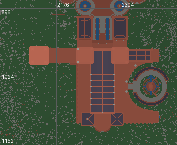
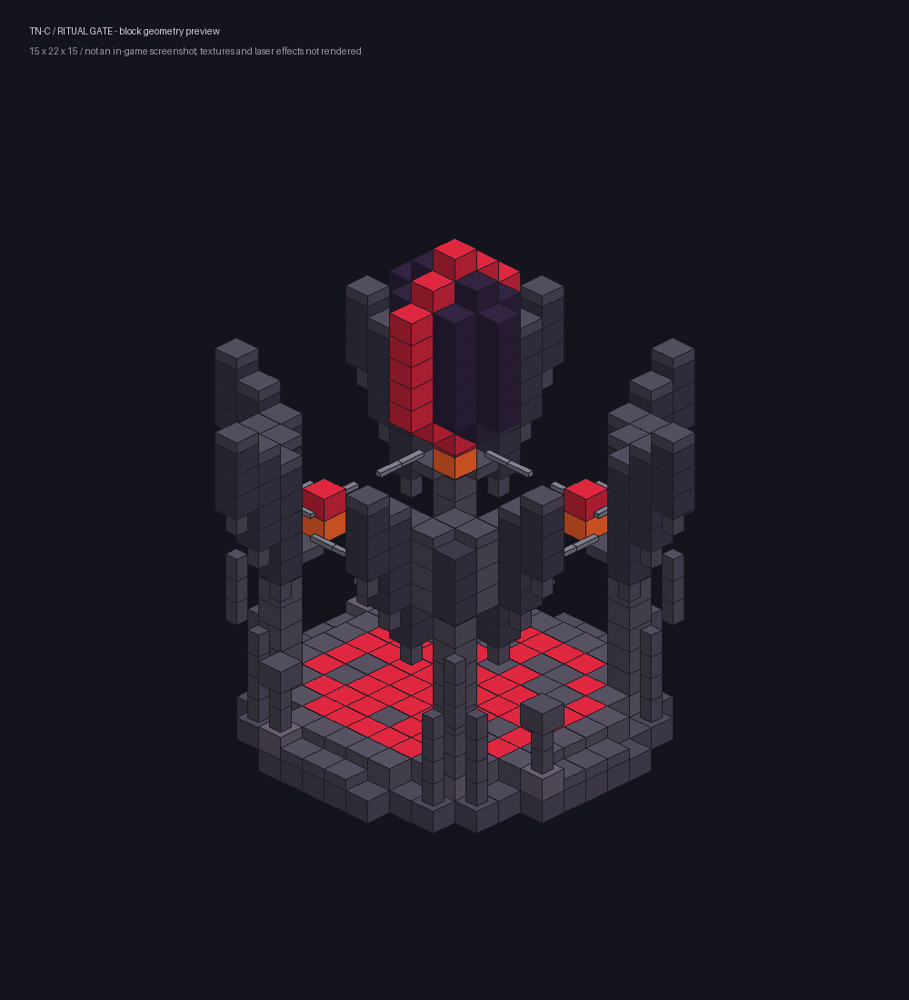

# 完整建筑接入与祭坛复刻（2026-09-27）

基线：合作者更新 b8d3f70，前一批建筑提交 252aeb6。本次继续处理剩余素材；不安装 WorldEdit，不改原世界、不删除原蓝图，不动合作者 NPC/法术/音乐逻辑。

## 素材清单与定位

| 素材 | 定位 ID | 当前接入范围 |
|---|---|---|
| 20260725 | `tnc:roadside_ruin` | 上一批完整蓝图 |
| fantasytavern | `tnc:fantasy_tavern` | 上一批完整酒馆 |
| Gothic castle | `tnc:gothic_castle` | 上一批完整蓝图 |
| Dark-Fantasy-Castle | `tnc:dark_fantasy_castle` | 上一批完整蓝图 |
| the-distortion-citadel | `tnc:abyss_citadel` | 上一批 B 方案：原尺寸城堡＋深渊巨坑 |
| end-pvp-island | `tnc:end_pvp_island` | 原尺寸 408×165×585，5,805,193 个非空气方块；主世界高空浮岛 |
| 赫萝斯堪德 | `tnc:stonecrest_fortress` | 南部宫殿完整侧翼、附属建筑和内院，含少量连接园景，排除北部小镇 |
| Gothic Cathedral | `tnc:gothic_cathedral` | 完整十字形教堂及尖塔，不含建筑零件展示区和外围园林 |
| Elden Lands | `tnc:elden_coastal_castle` | 西岸城堡群首批选区，不是整张数千格世界全部移植 |

用 `/locate structure <ID>`，到达后触发分批生成。大型建筑 `/tnc landmark status` 查看状态：0 检查、1 地形、2 建筑、3 完成、-1 保护性停止。
扭曲城堡仍用 `/tnc abyss status`。
定位点在南侧外围地面，不会自动把玩家传送到屋顶或半成品里。末地岛定位的是地面观察点；生存模式登岛路线、Boss、战利品、任务尚未配置。

**必须先在新测试存档验收。** 旧存档已生成的主殿不会被替换；同名定位也可能找到旧主殿。旧分块类型和资源仍保留以兼容存档。

## 可重现选区

边界顺序为 x0,y0,z0,x1,y1,z1，均包含端点。

- 赫萝斯堪德：`2064,128,880,2415,319,1167`；地面基准 166。加过渡后的画布 400×192×336，1,617,246 方块、1,253 模板。取消旧 `z<908` 和东侧矩形硬裁，北部小镇不在边界内。此前全中轴候选导出仅移至 `work/unused-heroskand-axis-20260927`，未采用，不影响原地图。
- 教堂：`112,-55,-640,543,302,-400`；地面基准 -54。采用独立完整建筑副本，避开原图中叠放的其他素材。原高 358；主世界原尺寸放置为 Y=-42..315，入口地面约 -41，用 96 格过渡形成下沉谷地。画布 624×358×433，1,362,064 方块、2,401 模板。
- Elden 西岸城堡：`-1056,48,-64,-800,160,144`；地面基准 68。画布 305×113×257，735,899 方块、559 模板。其他宫殿、废墟、小镇留在原世界，未声明整图完成。
- 末地岛：自动裁去原蓝图外部空白，不裁实体轮廓，3,128 模板，地形不做落地拼接。

读取工具：`tools/survey_world_buildings.py`（只读扫描，输出俯视图和高度数据）；导出工具：`tools/export_large_landmarks.py`。
原世界仍在用户既有路径；每份清单记录源区块文件 SHA256 或蓝图 SHA256、实际边界和兼容替换。
下面是这次宫殿的原世界俯视选区，不是新世界生成截图。对应侧翼及附属院落保留情况可据此核对：




世界导出示例：

```text
python tools/export_large_landmarks.py <世界目录> heroskand_complex --world --bounds 2064 128 880 2415 319 1167 --ground-y 166 --structure-id stonecrest_fortress --registry-jar <1.20.1原版client.jar> --registry-jar <ConquestReforged.jar>
```

教堂增加 `--sunken --blend 96`；蓝图浮岛增加 `--floating`。重新选择边界前应把旧生成目录移到工作区备份，避免留下无引用模板；不要删除源地图。

## 生成和保护

- 原生 structure_set 负责种子分布及 locate，只存一个起点；真正的超大建筑由服务器分批施工，避免原版八区块引用半径截断远处侧翼。
- 地面型只选择起伏有限的陆地区域，依据建筑投影形成非矩形地基和自然材质过渡；浮岛保留完整岛底，避开过高地形。
- 每个模板最多 16³，一次放一片；地形每 tick 有扫描数量和约 6ms 时间片上限。区块使用票据驱动、非阻塞轮询，不强制同步等待。
- 预检完成后原地形与资源指纹先写独立不可变文件并刷盘，再开始施工。完成位与区块一起保存，恢复时核对完成位；已经完成的部分不会重复覆盖玩家装修。
- 加载/放置后释放模板缓存，避免数百万方块对象长期滞留。
- 检查居住时长、工地附近玩家、实际写入范围内的方块实体和其他大型遗迹；每次地形写入/模板放置前重新检查容器，保护检查不只做一次。
- 这些是防误伤措施，不是完整领地系统。断电、硬盘损坏、其他模组同时改地形不在恢复保证内。若中断留下无法确认归属的容器，会安全停止而不清空它。
- 不导入命令方块逻辑、实体、原图库存和战利品 NBT；Boss 与玩法单独制作。

## 参考图祭坛

最新版本见 [蓄能光束设计](portal-lasers-20260927.md)。实际方块模板，不是图片贴图：15×22×15 黑石圆台、发光红色五芒星、四角窄身兜帽翼状守卫、托举能量晶体、外圈悬链及高悬黑红核心。
保持原传送点与 15×15 占地，避免为了放大雕像而覆盖既有天空岛建筑。有限尺寸的方块雕塑无法像参考图那样细腻；这是紧凑风格复刻，不宣称像素级还原。



上图仅为方块几何预览，不是游戏截图；材质、透明玻璃效果、光影和游戏粒子不在此渲染中。
蓄能改为 4 秒：符文苏醒 → 四柱汇聚连续激光 → 核心贯穿阵心 → 双向传送，只有视觉与音效，没有激光伤害。新存档自动使用；旧存档先离开两座传送阵，再执行 `/tnc skyportal refresh`。预检遇到箱子、玩家改造、上方障碍或生物会拒绝更新，不会整块清空。
需要同时更新 TN-C JAR 与 `kubejs/data/tnc/structures/sky_island/portal/` 下两个 NBT，重启客户端后测试。

## 验证记录

- Python 模板检查：全部大型分块的尺寸、边界、计数、禁用逻辑 NBT；门户路径净空与稳定落点。
- Java 测试覆盖教堂完整高度、浮岛避山、宫殿地基偏移和全部模板路径。
- 开发 Forge GameTest：普通模板及大型原版模板加载、区块预检推进、小型实际施工、重新读取进度后保留玩家修改；另测地下无关箱子与预检后新增箱子的保护。
- Conquest 模板离线对照已安装 Conquest 的方块资源核验；精简测试服务端没有 Conquest，不冒充完整整合包兼容验收。
- 整座大型建筑的全流程耗时、所有生物群系的外观、完整整合包视觉效果仍需游戏内验收。

2026-09-27 02:03:35，最终精简 Forge 服务端报告 `All 7 required tests passed`。预检后新增箱子的用例会故意触发一条保护性停止日志，这是测试断言的一部分。
Python 大型模板 3 项、天空岛/传送阵 9 项检查通过。代码复查的保护范围和模板缓存问题均已修复。

后续激光更新的最终结果：41 项 Java、10 项 Python 天空岛/门户、10 项 Forge GameTest 通过（02:27:18）。安装与回滚记录见 [门户更新记录](portal-lasers-20260927.md)。此前 7/9 项为上一轮结果。

JAR 按队友规则不纳入 Git；队友需要编译或另收构建 JAR，仅拉源码不会更新游戏中旧模组。
安装工具：`tools/install-landmark-update.ps1 -LivePack <PCL实际实例目录>`。它会检查游戏/开发 JVM 已退出，备份旧 JAR 和两座传送阵模板，复制并逐个核对 SHA256；失败则恢复三份原文件。不会结束任何游戏进程。
